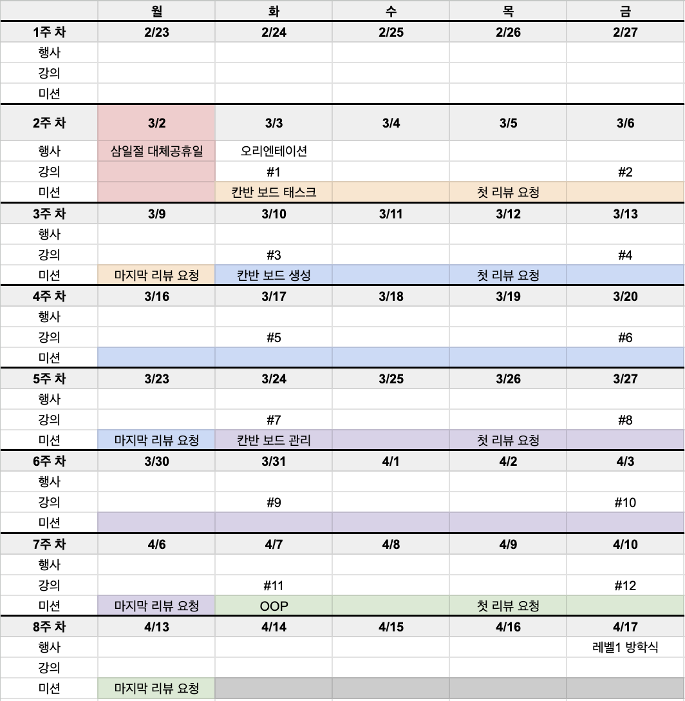
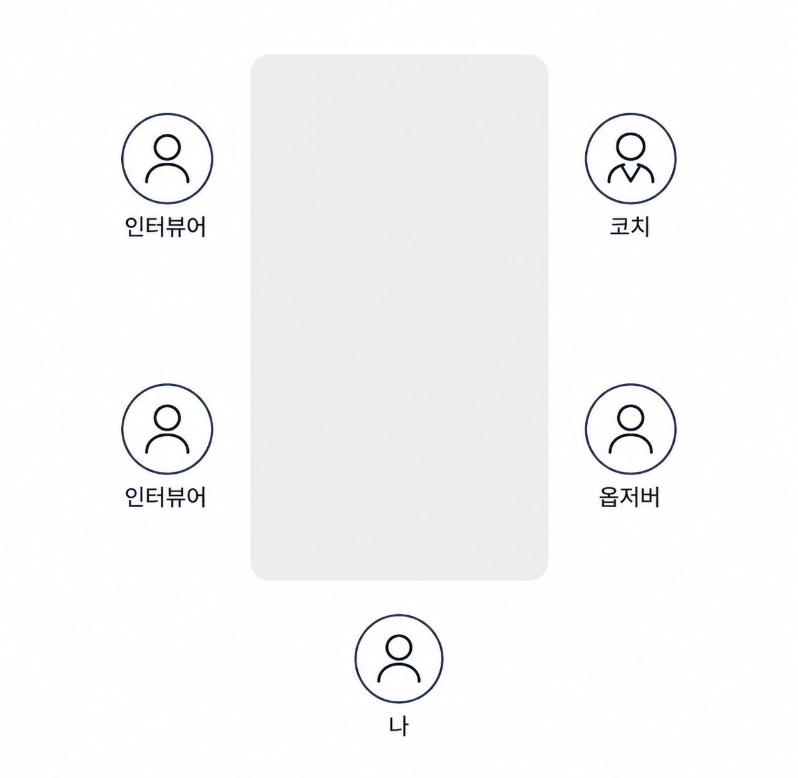

## 레벨 1 일정 및 커리큘럼

### 커리큘럼

#### 0. 온보딩 - 사용자가 있는 Gemini 웹앱 출시하기

온보딩 과정에서는 AI를 활용한 프로덕트 개발을 경험했습니다.  
프롬프팅을 어떻게 해야 원하는 결과를 더 잘 얻을 수 있는지 고민해보고, 최대한 많은 웹을 생성하고 아이디어를 구현해보는 것이 목표였습니다.

#### 1. 컴포즈 기초

첫 번째 본격적인 미션에서는 Jetpack Compose의 기본 개념과 문법을 사용했습니다.
선언형 프로그래밍 패러다임이 무엇인지, 기존 UI 방식과 어떤 차이가 있는지 이해하는 것부터 시작했습니다.

또한 Compose에서 중요한 개념인 리컴포지션(Recomposition)을 배우고, UI 테스트를 구성하는 요소들을 학습하며 실습해보았습니다.

#### 2. 컴포넌트

두 번째 단계에서는 Navigation, Lazy, Material3 등 Compose에서 자주 사용하는 컴포넌트들을 다뤘습니다.  
상태 호이스팅(State Hoisting), Stateless/Stateful 컴포넌트 구조에 대해 배우며, 상태를 어디에서 관리하고 어떻게 전달해야 하는지 고민하게 되었습니다.

또한 Compose를 사용하면서 필요한 비동기 개념인 suspend 함수 등에 대해서도 함께 학습했습니다.

#### 3. 상태 관리

세 번째 단계에서는 상태 관리와 Side-effect API를 중심으로 학습했습니다.  
Compose에서 상태가 변경될 때 UI가 어떻게 다시 그려지는지, 불필요한 리컴포지션을 줄이기 위해 어떤 점을 고려해야 하는지 배웠습니다.

특히 리컴포지션 최적화와 도넛홀 스키핑 같은 개념을 접하면서, 단순히 화면을 구현하는 것뿐만 아니라 성능과 구조까지 함께 고민해야 한다는 것을 느꼈습니다.

#### 4. OOP

마지막 단계에서는 객체 지향 설계 원칙을 기반으로 도메인을 구현했습니다.  
JUnit을 활용해 단위 테스트를 작성하고, 리팩터링을 통해 코드 품질을 개선하는 과정을 경험했습니다.

또한 데이터베이스 연동과 Spring Boot를 통한 HTTP API 구현까지 범위를 확장하며, 클라이언트 화면 구현을 넘어 백엔드와 연결되는 흐름까지 함께 다뤄볼 수 있었습니다.

---

1레벨의 모든 과정을 지나오며 배운 점도 많았지만, 동시에 습득해야 할 양이 정말 많다는 것도 느꼈습니다.  
전체를 100이라고 한다면, 그중 제가 제대로 이해한 것은 아직 30도 되지 않는 것 같다는 생각이 들었습니다.

처음에는 모든 내용을 온전히 흡수하지 못하는게 아쉽기도 했고, 스스로에게 실망하기도 했습니다.  
하지만 생각해보면 처음부터 모든 것을 완벽하게 이해하고 받아들이는 것은 어려운 일이라는 생각이 듭니다.

지금의 부족함도 성장 과정의 일부로 받아들이고, 계속해서 고민하고 노력하다 보면 언젠가는 지금보다 더 많은 것들을 제 것으로 만들 수 있을 것이라 믿습니다.

## 페어 프로그래밍

우테코에서는 각 단계로 넘어가기 전에 수업을 진행하고, 새로운 미션마다 매번 다른 페어와 함께 미션을 진행하게 됩니다.

기본적인 흐름은 처음 미션을 페어와 함께 구현하고, 이후 코드 리뷰를 받은 뒤 리팩터링과 디벨롭은 혼자 진행하는 방식입니다.

그동안 주로 혼자 개발을 해왔기 때문에, 처음에는 누군가와 함께 코드를 작성한다는 것이 어색하기도 했습니다. 하지만 페어 프로그래밍을 하면서 혼자였다면 생각하지 못했을 여러 방식들을 접할 수 있었습니다.

가장 큰 장점은 **생각의 확장**이었습니다.  
늘 제가 쓰던 방식만 고집하는 것이 아니라, 다른 사람이 문제를 바라보는 방식과 구현하는 방식을 보며 새로운 관점을 얻을 수 있었습니다.

물론 어려운 점도 있었습니다. 서로 의견이 다를 때는 자신의 생각을 설명하고, 왜 이 방식이 더 적절하다고 생각하는지 근거를 들어 이야기해야 했습니다. 그 과정에서 생각보다 많은 시간이 걸리기도 했습니다.

하지만 돌이켜보면 이것은 단점이라기보다, 정해진 시간 안에 빠르게 구현해야 하는 상황에서 생기는 아쉬움에 가까웠던 것 같습니다.  
오히려 서로의 생각을 나누고, 개념을 공유하며 정리해가는 과정 자체가 매우 의미 있었습니다.

---

## 리뷰어

“현업자가 내 코드를 본다?”

처음 코드 리뷰를 받는다는 사실은 생각보다 큰 부담으로 다가왔습니다.  
내 코드가 누군가에게 평가받는다는 느낌이 강했고, 리뷰 코멘트를 받을 때마다 마치 제 코드가 틀렸다는 말을 듣는 것 같아 괜히 민망하기도 했습니다.

코치님들은 리뷰어를 잘 활용하라고 말씀해주셨습니다.  
리뷰어의 말이 항상 정답은 아니고, 리뷰어마다 의견이 다를 수도 있으니 본인이 맞다고 생각하는 부분이 있다면 의견을 말하고 토의해보라고 하셨습니다.

하지만 처음에는 저보다 훨씬 잘 아는 분의 말이 전부 맞는 것처럼 느껴졌습니다.  
토의를 하고 싶어도 제가 가진 지식이 얕다고 느껴져 쉽게 제 생각을 말하지 못했습니다.

그래도 리뷰어님들께서 편하게 질문하고 이야기할 수 있는 분위기를 만들어주셨고, 직접 방문해 이야기를 나눌 기회도 있었습니다. 덕분에 지금은 초반보다 훨씬 편하게 제 생각을 이야기하고, 리뷰어에게 질문할 수 있게 된 것 같습니다.

앞으로는 조금 더 지식을 깊게 쌓아서, 단순히 피드백을 받는 것에서 그치지 않고 리뷰어님과 진짜로 의견을 주고받을 수 있는 사람이 되고 싶다고 생각했습니다.

또 하나 느낀 점은, 누군가 내 코드를 본다는 생각에 너무 사로잡혀 있었다는 것입니다.  
조금 더 좋은 구조, 더 좋은 코드에 집착하다 보니 PR을 올리고 리뷰어와 핑퐁하는 시간이나 이야기를 나누는 시간이 다소 짧아졌다고 느꼈습니다.

특히 “지금 작성한 코드는 내일의 레거시가 된다는 것을 기억했으면 좋겠다”, “소통을 많이 하지 못했다”라는 피드백이 기억에 남았습니다.

온라인으로 계속 소통을 이어가는 것에 어려움을 느끼는 점, 그리고 완벽하게 만들고 나서 보여주고 싶어 하는 제 성향이 그대로 드러난 피드백이었다고 생각합니다.  
이 부분은 앞으로 우테코 생활을 하면서 천천히 적응하고 고쳐나가야 할 부분인 것 같습니다.

---

## 그 외에도…

우테코에서는 미션 외에도 다양한 활동들이 진행됩니다.

공통 수업에서는 웹으로 이력서를 만들어보거나, 데이터베이스 수업을 통해 자신의 파트가 아닌 영역의 기본 지식도 함께 배울 수 있었습니다.

소프트 스킬 시간에는 자신의 생각과 경험을 어떻게 말로 정리하고 전달할 수 있는지 배웠습니다.  
레벨이 끝날 때마다 진행되는 인터뷰에서는 그동안 무엇을 배웠고, 어떤 지식을 습득했는지 그룹별로 코치와 크루 앞에서 이야기하고 질의응답하는 시간도 가졌습니다.

참고로 인터뷰는 이런 구도로 진행됩니다.  
일대다로 앉아 있다 보니 처음에는 꽤 긴장되는, 조금 폭력적인 구도였습니다...

또한 회고 작성, 크루들과의 교류, 테크톡 발표 등 개발 지식뿐만 아니라 함께 성장하기 위한 다양한 활동들도 있었습니다.

처음에는 모든 활동이 낯설고 부담스럽기도 했지만, 시간이 지나면서 우테코가 단순히 기술만 배우는 곳은 아니라는 것을 조금씩 느끼고 있습니다.  
기술을 배우는 동시에, 나의 생각을 정리하고 사람들과 소통하며 함께 성장하는 방법을 배워가는 과정이라고 생각합니다.

아직은 모든 것이 익숙하진 않지만, 저도 조금씩 우테코 생활에 적응해가는 중입니다.
