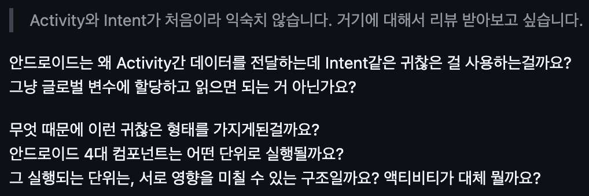

> 이 글은 Intent와 Activity에 대해 어느 정도 알고 있는 독자를 기준으로 설명한 글이다.


> 우테코 미션 중, PR에서 Activity와 Intent 관련하여 질문을 받았다. 그에 대한 질문들과 답변들을 모아서 정리하여 쓴 글이다. 질문에 답변하느라 힘을 많이 써서 노력한게 아까워서라도 블로그에 써야겠다.

안드로이드의 Activity와 Intent를 배우고 자연스러운 의문이 하나 생긴다, 왜 Intent를 사용해서 값을 전달할까? 이전에 다루었던 프레임워크인 Flutter는 Intent 같은 특별한 경로를 두지 않고 값이 전달이 가능했는데, 정작 네이티브인 안드로이드는 더 복잡한 처리를 하고 있는 것처럼 보인다.

이 글은 위 의문을 해소하고 그 과정 중에 발생하는 통찰을 다룬다.

## 0\. Intent
다음 코드는 Intent를 사용하여 값을 activity로 전달하는 간단한 예시이다.
```
val intent = Intent(this, DetailActivity::class.java)
intent.putExtra("productId", 42)
startActivity(intent)
```

Intent는 Activity간 통신을 주관하며, 값을 전하거나 명시적 Intent를 사용하여 내 앱의 다른 Activity로 전환하거나 묵시적 Intent를 사용하여 다른 앱의 서비스(카메라, 갤러리 등)를 불러올 수 있다.

값을 넣는 쪽에서는 intent에 `putExtra`로 값을 넣고 값을 받는 쪽에서는 `Bundle`로 전달되어`getExtra` 를 통해 값을 받는다. 지금은 단순히 원시값을 전달하려고 하지만, 내가 만든 객체는 넣을 수 없다.

---

## 1\. Activity란 무엇인가

Activity란,

-   사용자가 보는 하나의 ”화면” 단위
-   시스템이 Life Cycle을 관리하는 단위

여기에서, 두번째 줄에서 시스템이 Life Cycle을 관리한다고 하였다. 이말은 즉, “Activity를 전환하거나 Activity가 켜지고 꺼질 때의 상태를 개발자가 직접 관리하지 않는다.”라는 말과 같다.

---

## 2\. 글로벌 변수로 충분한 거 아닌가?

Activity 전환은 내 프로세스에서 이루어지고 같은 메모리를 공유한다. 따라서 글로벌 변수를 사용하여 값을 공유하는 직관은 언뜻 합리적이란 생각이 든다.

아래 코드는, 싱글톤 객체를 두고 그 값을 공유하는 과정을 표현하였다.

```
object GlobalState {
    var productId: Int = 0
}

// ActivityA
GlobalState.productId = 42
startActivity(Intent(this, ActivityB::class.java))

// ActivityB
val id = GlobalState.productId   // 42
```

안드로이드에서도 Activity간 값 공유에 위 코드처럼 실제로 값을 전달할 수 있고 사용할 수 있을 것 같다. 하지만, 아래와 같은 문제가 발생한다.

1.  컴포넌트 간 결합도 증가
2.  메모리 낭비(가비지 컬렉션 어려움)
3.  데이터 이동 경로 파악 어려움
4.  테스트 어려움

사실 안드로이드 플랫폼을 생각하면 그리 와닿는 설명은 아니다. 안드로이드뿐만 아니라 다른 플랫폼에서도 위와 같은 이유를 가지고 전역변수로 값을 공유하지 않는 이유를 설명할 수 있을 것이다.

---

## 3\. 전역 변수가 깨지는 순간
> 해당 글부터 프로세스와 앱을 동시에 다루는데, 내 앱과 내 프로세스는 같지 않은 개념이라는 점을 유념하길 바란다.
> 보통 앱은 하나의 프로세스를 갖지만 여러 프로세스로 나뉘는 경우도 있다.

### 3-1. Process Death

앱을 켜두고 다른 작업을 오랫동안 수행했을 때 메모리가 부족하면 안드로이드 시스템은 메모리를 확보하기 위해 사용하지 않는 프로세스를 종료시킨다. 이를 Process Death라고 하고 최근 앱 목록에서 종료된 앱을 누르면 시스템은 종료되기 전 마지막 Activity를 재생성하려고 한다.

Process Death가 발생하고 앱을 복구하려고 하면, 프로세스가 종료되었기에 전역 변수에는 초기값이 설정된다. 반면에, Intent로 전달했다면, 시스템의 Bundle에 값이 저장되어 있어 그 값으로 앱을 복구 할 수 있다.

### 3-2. 다른 프로세스로 가는 경우

프로세스 별로 메모리 공간이 분리되어 있기 때문에 내 앱이 가지고 있는 전역 변수는 내 프로세스만 알 수 있다. 그렇기에 다른 프로세스로 이동해버리면 내 전역 변수는 사용할 수 없다.

-   묵시적 Intent로 다른 앱을 호출하는 경우 (예: 카메라, 공유 시트)
-   `android:process`로 같은 앱 안에서 Activity를 다른 프로세스로 분리한 경우

---

## 4\. 같은 프로세스 안에서도 IPC가 일어난다

이전 문단에서 다룬 Process Death는 기기 성능이 비약적으로 향상된 지금에서야 잘 발생하기 어렵다. 또한, 내 앱에서만 모든 걸 처리하고 다른 프로세스로 가는 경우만 없으면 전역 변수로 사용해도 될 것 같다.

사실, 같은 앱에서 Activity를 이동해도 IPC가 필요하다. Activity 전환은 내 앱에서만 이루어지는 게 아니라 시스템의 `ActivityManagerService` 를 거친다. 즉, 아래와 같은 구조를 갖는다.

ActivityA → system\_server (`ActivityManagerService`) → ActivityB

---

## 5\. 왜 “프로세스간 통신”인가?

Activity에서 Activity로 이동하는 케이스가 대표적이지만, “프로세스간 통신”이라는 용어는 적절치 않았다고 생각할 수 있다. 상술했던 여러 상황에 대해 아래 설명을 보면 납득할 수 있을 것이다.

1.  ActivityA -> 시스템 프로세스 -> ActivityB 의 경우에는 시스템 프로세스를 한번 거치기에 프로세스간 통신이라 할 수 있음
    -   내 앱 -> 시스템 프로세스 : 내 앱에서 시스템 프로세스의 `ActivityManagerService`와 통신하기 위해서 IPC가 필요함
    -   시스템 프로세스 -> 내 앱 : 시스템 프로세스에서 내 앱의 Activity를 호출하기 위해서 IPC가 필요함
2.  `android:process`로 Activity를 구분한 경우 같은 앱이지만 다른 프로세스이기에 프로세스간 통신이라 할 수 있음
    -   `android:process`로 Activity를 분리하면, 같은 앱이어도 다른 프로세스가 되어 메모리가 격리됨. 따라서 두 Activity 간 데이터 공유에 IPC가 필요해진다.
3.  묵시적 Intent를 통해 내 앱이 아닌 "다른 앱", 즉 "다른 프로세스"를 호출하는 경우에 다른 프로세스에 정보를 전달하기에 프로세스간 통신이라 할 수 있음
    -   내 앱 -> 시스템 프로세스 : 내 앱에서 시스템 프로세스의 `ActivityManagerService`와 통신하기 위해서 IPC가 필요함
    -   시스템 프로세스 -> 다른 앱 : 시스템 프로세스에서 다른 앱으로 통신하기 위해 IPC가 필요함

---

## 6\. 다시 처음 질문으로

> 안드로이드는 왜 Intent를 쓰는 걸까?

-   Activity 전환 시 시스템 프로세스를 거치므로, 객체 주소가 아닌 바이트(직렬화된 값)로 넘겨야 한다.
-   그 평탄화된 값들을 담은 `Bundle`을 시스템이 보관하므로, Process Death 이후에도 복구가 가능하다.

---

## 7\. Flutter는?

### 플러터는 "단일 Activity" 모델이다

플러터 앱은 안드로이드에서 보면 보통 **`FlutterActivity` 하나**로 시작한다. 그 한 개의 Activity 안에서 모든 UI가 그려진다.

플러터에서 말하는 "화면"은 안드로이드의 Activity가 아니라 **위젯 트리의 한 노드**다. 화면 전환은 시스템 컴포넌트를 갈아끼우는 게 아니라, **`Navigator`가 위젯 스택을 push/pop하는 것**이다.

아래 코드는 플러터에서 화면을 전환하는 코드이다.

```
Navigator.push(
  context,
  MaterialPageRoute(builder: (_) => DetailPage(product: product)),
);
```

`product`라는 객체가 그대로 다음 화면 위젯의 생성자로 들어간다. 직렬화도 putExtra도 없다.

### 왜 그게 가능한가

같은 프로세스, 즉, 같은 Dart 런타임 안에서 일어나기 때문이다.

-   시스템 프로세스를 거치지 않는다 - `system_server`도 `ActivityManagerService`도 끼지 않는다.
-   객체의 가상 주소가 그대로 의미를 가진다.
-   그래서 직렬화 자체가 필요 없다.

### 왜 그런 길을 골랐나

-   **플랫폼 독립성** - iOS, Web, Desktop에서 동일한 동작이 필요하다. 안드로이드 컴포넌트 모델에 묶이는 순간 그 약속이 깨진다.

즉, 플러터는 "OS에 컴포넌트 관리를 맡기는 안드로이드의 모델"을 의도적으로 빠져나왔다. 자기 안에서 UI·네비게이션·상태 관리를 다 해버린다.

### 두 길의 비교

| 항목 | 안드로이드 (네이티브) | 플러터 |
| --- | --- | --- |
| 화면 전환 단위 | 시스템이 관리하는 Activity | 위젯 트리의 노드 |
| 화면 전환 경로 | 내 앱 → system\_server → 내 앱 | 같은 isolate 안 |
| 데이터 전달 | Intent + Bundle (직렬화) | 객체 참조 그대로 |
| Process Death 복원 | 시스템 + Bundle이 책임짐 | 개발자가 직접 (Restoration API) |
| 외부 앱 통합 | 자연스럽게 Intent | Platform Channel 경유 |

---