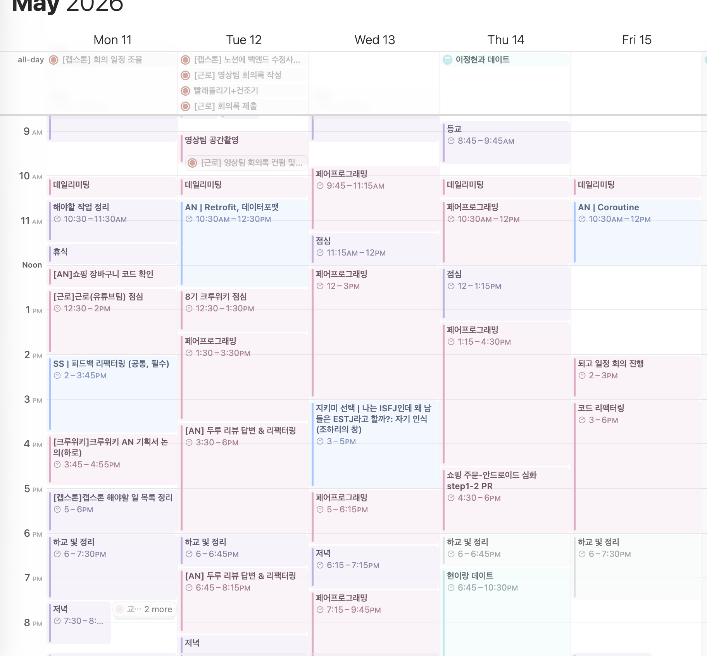
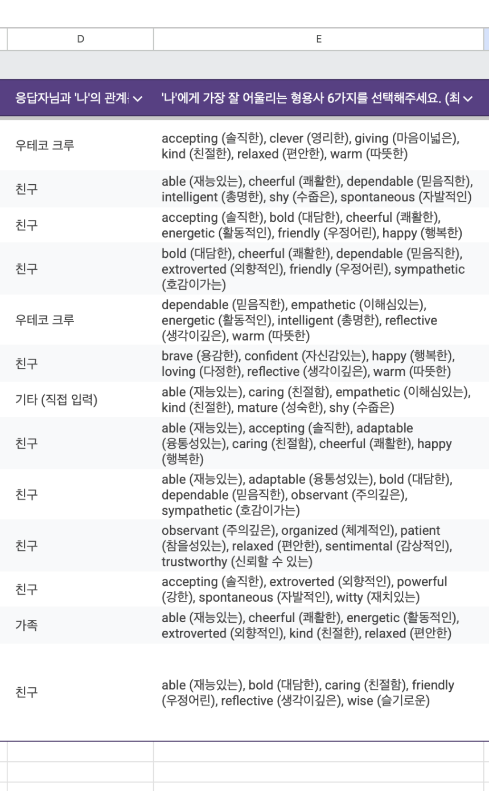

## 5월 2주차 회고

레벨 2가 시작되고 어느덧 5월 중순이 지나가면서, 우테코에서의 생활도 조금씩 자리를 잡아가기 시작했다.
정신없이 흘러가기만 하던 하루들이 이제는 “내가 어떤 활동을 하며 살아가고 있는지” 정도는 돌아볼 수 있을 만큼 정리되기 시작한 느낌이다.

요즘의 나는 크게 아래와 같은 활동들을 중심으로 하루를 보내고 있다.

* 우아한테크코스 근로 활동 (유튜브 팀)
* 크루위키 활동
* 안드로이드 주차 과제
* 지키미 활동
* 글쓰기 활동

특히 최근 가장 크게 달라진 점은, 기존에 사용하던 다이어리 대신 애플 캘린더를 적극적으로 사용하기 시작했다는 점이다.
분 단위로 어떤 활동을 했는지 기록하고 다시 돌아보는 방식인데, 이렇게 생활을 정리하다 보니 내가 어떤 하루를 보내고 있는지가 훨씬 선명하게 보이기 시작했다.

예전에는 단순히 “오늘도 바빴다” 정도로 하루를 넘겼다면, 이제는 무엇에 시간을 쓰고 있고 어떤 부분에서 지치거나 즐거움을 느끼는지를 조금 더 명확하게 바라볼 수 있게 된 것 같다.

이번 회고에서는 최근 가장 큰 비중을 차지했던 활동들을 중심으로 정리해보려고 한다.

---

## 과제

레벨 2가 시작되고 나서 가장 먼저 체감했던 건, 이전 단계와의 난이도 차이였다.
기존보다 고려해야 하는 개념과 구조가 훨씬 많아지면서 처음에는 따라가는 것 자체가 꽤 버겁게 느껴졌다.

특히 어려운 개념들을 공부할 때 AI를 적극적으로 활용해보고 싶다는 생각이 들었는데, 레벨 1에서는 거의 사용하지 않고 공부했기 때문에 “AI를 어떻게 활용해야 제대로 공부할 수 있을까?”에 대한 고민도 많았다.

거기에 일정까지 빡빡하다 보니 하루하루를 정신없이 보내게 되었고, 다이어리를 제대로 쓰지 못할 정도로 여유 없는 생활이 이어졌다.

그래서 이번에는 캘린더를 적극적으로 활용하면서 다시 회고를 써보자는 마음을 먹게 되었다.
기록하지 않으면 정신없이 흘러가기만 할 것 같아서, 다시 차근차근 정리해보려 한다.

이번 장바구니 미션을 진행하면서는 단순히 Room DB만 사용하는 수준에서 끝나는 것이 아니라, 백엔드 API 연결이 들어오며 고려해야 하는 요소들이 굉장히 많아졌다.
특히 Repository의 역할과 구조를 공부하면서, 내가 아직 부족한 부분이 많다는 걸 체감하게 되었다.

이번 단계에서는 내 코드를 기반으로 다음 미션을 이어가기로 페어인 엘리와 함께 결정했다.
그래서 먼저 “어떤 방향으로 구현할지”, “기능 흐름을 어떻게 가져갈지”를 빠르게 정리하기 위해 README.md부터 작성했다.

큰 틀을 먼저 정리해두고 나니 이후 작업 방향도 훨씬 선명해졌다.

README를 작성한 뒤에는 최대한 빠르게 머지하기 위해 리팩토링에 많은 시간을 쏟았다.
이번 리팩토링에서 가장 집중했던 부분은 “구조”와 “정리”였다.

색상과 폰트 스타일을 공통으로 정리하고, 이를 로직으로 관리할 수 있도록 수정하기도 했고, 패키지 구조를 다시 나누는 작업도 함께 진행했다.

하지만 네트워크 관련 내용이 들어오기 시작하면서 알아야 하는 개념의 양이 급격하게 늘어났고, 공부 속도가 더디다는 것도 많이 체감했다.
그래도 조급해하기보다는 내가 할 수 있는 범위부터 하나씩 챙겨가려고 노력하고 있다.

무엇보다 좋았던 건, 혼자 끙끙 앓기보다 페어와 함께 여러 방법을 고민해볼 수 있었다는 점이다.
“이 방법은 어떨까?”, “이 구조가 더 낫지 않을까?” 같은 이야기를 계속 나누다 보면, 어느 순간 둘 다 납득할 수 있는 방향으로 정리가 되어 있었다.

혼자였다면 훨씬 오래 헤맸을 문제들도 함께 고민하는 과정 속에서 많이 배우고 있다는 생각이 든다.

---

## 지키미 활동

레벨 2에 들어오면서 본격적으로 지키미 교육도 시작되었다.

나는 매주 강의를 하나씩 수강하도록 신청해두었는데, 이번에는 “조하리의 창”을 경험해볼 수 있는 기회가 있었다.

결론부터 말하자면, 이 활동을 신청하길 정말 잘했다는 생각이 들었다.

사실 다른 사람들에게 “나를 어떻게 생각하나요?”라고 묻는 건 꽤 용기가 필요한 일이었다.
그래도 수업을 위해 직접 폼을 만들고 인스타 스토리에 올렸는데, 감사하게도 총 13명이 답변을 남겨주었다.

다른 사람들의 시선 속의 나를 읽어 내려가는데, 생각보다 훨씬 따뜻한 말들이 많아서 괜히 울컥하기도 했다.

특히 질문 항목 중
“당신이 생각하는 나의 가장 인상 깊은 장면이나 모습은 무엇인가요?”
라는 문항이 있었는데, 솔직히 이렇게 다정한 답변들이 돌아올 거라고는 예상하지 못했다.

개인적으로 그 답변들은 마치 “내가 아끼는 거울” 같은 느낌이었다.
지금도 마음 한편에 고이 담아두고, 가끔씩 꺼내보고 싶다는 생각이 든다.

재미있었던 건, 내가 스스로 선택한 키워드와 다른 사람들이 나를 바라보며 골라준 키워드가 거의 정반대였다는 점이다.

조금 민망하기도 해서 어떤 키워드였는지는 이 글에 적지 않으려 한다.
그건 강의를 함께 들은 크루들끼리만 알고 있는 비밀 정도로 남겨두고 싶다.

이번 활동을 통해, 내가 생각하는 나와 다른 사람들이 바라보는 나 사이에는 꽤 큰 간극이 있다는 걸 느꼈다.

그리고 그 간극을 바라보며 오히려 스스로를 조금 더 다정하게 대해야겠다는 생각이 들었다.

나는 생각보다 스스로를 너무 몰아붙이며 살아가고 있었던 건 아닐까?

조하리의 창은 단순한 심리 활동이 아니라, 내가 모르는 나를 발견하고 동시에 주변 사람들의 따뜻함까지 느끼게 해준 시간이었다.

---

## 근로

최근에는 본격적으로 우테코 근로 활동도 시작하게 되었다.

나는 콘텐츠 팀의 유튜브 파트에 지원했고, 지금은 그 팀에서 활동하고 있다.

처음 지원한 가장 현실적인 이유는 생활비 때문이었다.
하지만 동시에 언젠가는 꼭 한 번 영상 업로드를 스스로 해보고 싶다는 마음도 있었고, 언젠가 내 채널을 직접 운영해보고 싶다는 생각도 오래전부터 하고 있었다.

그래서 큰 고민 없이 유튜브 팀에 지원하게 되었다.

현재 유튜브 팀은 모카, 고래, 포도, 그리고 나까지 총 네 명으로 이루어져 있다.
다들 성격도 좋고 일 처리도 시원시원해서, 함께 활동하는 시간이 꽤 즐겁다.

요즘은 직접 영상을 촬영하고 편집하면서, 내가 만든 영상 하나가 우테코를 처음 접하는 누군가에게 “우테코의 첫인상”이 될 수도 있겠다는 생각을 종종 한다.

그 생각을 하면 조금 설레기도 한다.

현재 첫 업로드 영상을 편집하고 있는데, 분명 오래 걸리고 쉽지는 않지만 이상하게 꽤 즐겁다.

첫 영상의 주제는 우테코 생활 공간 소개 영상이다.

이미 공간남 영상도 존재하지만, 개인적으로는 조금 더 “우테코를 처음 보는 사람”의 시선에서 쉽게 이해할 수 있는 영상을 만들고 싶었다.

건축적인 설명보다는, 실제로 어떤 분위기에서 생활하고 공부하는지에 가까운 영상을 담고 싶다는 마음이 더 컸던 것 같다.

---

## 글쓰기 활동

글쓰기 활동은 사실 지금 이 글을 쓰고 있는 바로 이 순간에도 진행 중인 활동이다.

그래서 이 내용을 회고에 넣을지 말지 꽤 고민했다.
하지만 활동의 시작점에서 지금의 마음가짐과 고민을 적어두지 않으면, 괜히 내 마음속에서 흐지부지 사라질 것 같은 기분이 들어 결국 적어보기로 했다.

사실 레벨 1 때부터 “블로그 써야지”라는 생각은 계속 하고 있었다.
그런데 우테코 활동, 졸업작품, 학교 생활까지 겹치다 보니 막상 글을 쓰기 시작할 여유가 쉽게 나지 않았다.

그런 와중에 글쓰기에 대해 함께 이야기하고 서로 피드백할 수 있는 기회가 생겼고, 그 활동에 참여할 수 있게 된 건 정말 감사한 일이었다.

개인적으로 나는 글의 색깔이 꽤 강한 편이라고 생각한다.
어떤 글은 굉장히 두서없고 감정적이기도 하고, 또 어떤 글은 지나치게 문학적인 분위기를 띠기도 한다.

그래서 이번 활동을 통해 “내가 어떤 글을 쓰고 싶은 사람인지”를 조금 더 정리해보고 싶다.

그리고 올해가 끝나기 전에는, 블로그 글보다는 길고 에세이 혹은 소설이라기엔 짧은 형태의 단편 글 하나를 꼭 써보고 싶다는 작은 꿈도 있다.

이 활동이 결국 어디로 이어질지는 아직 잘 모르겠다.

그래도 일단은 계속 써보려고 한다.
아마 쓰다 보면, 나도 조금씩 알게 되지 않을까.
